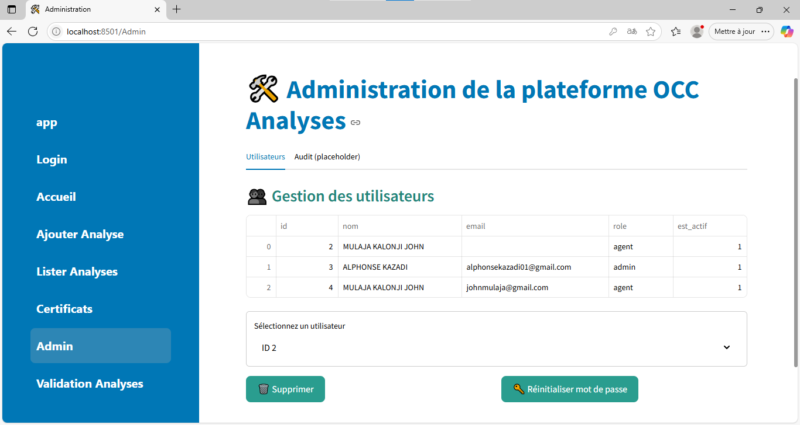
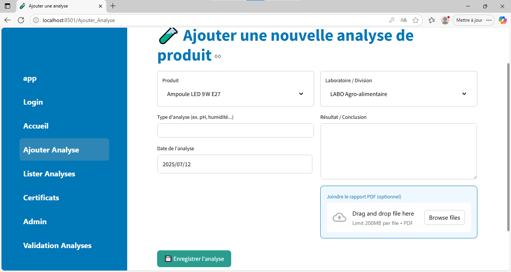
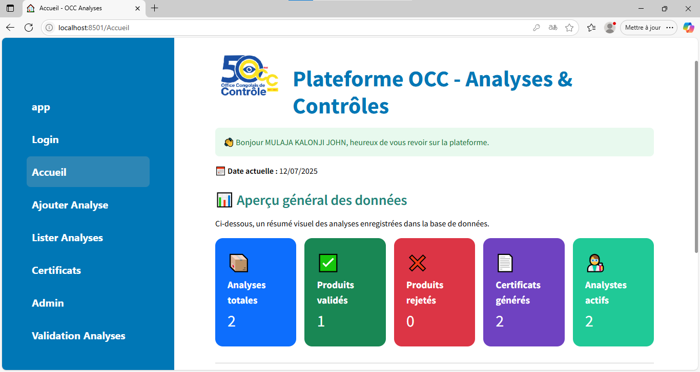

# OCC Analyses App


Bienvenue sur **OCC Analyses App**, une application web moderne dédiée à l’analyse et au contrôle des produits à l’OCC/Mbujimayi.

---

## 🚀 Présentation

OCC Analyses App facilite la gestion, l’analyse et le suivi des produits soumis au contrôle de l’OCC. L’outil offre une interface intuitive, des tableaux de bord dynamiques, et une sécurité renforcée pour répondre aux attentes des professionnels du secteur.

---

## 🏆 Fonctionnalités Clés

- **Gestion des analyses** : Suivi complet des produits et résultats d’analyses.
- **Tableaux de bord interactifs** : Visualisation des données en temps réel.
- **Notifications & Alertes** : Restez informé des anomalies ou statuts critiques.
- **Recherche avancée** : Filtres puissants pour retrouver rapidement les informations.
- **Sécurité** : Authentification robuste et gestion des utilisateurs.

---

## 💻 Aperçu de l’interface


*Exemple du tableau de bord principal.*


*Liste des analyses en cours.*

> _Remarque : Si les images ne s’affichent pas sur GitHub, vérifiez que les fichiers `Interfaceadmin.png` et `Interfaceuser.png` (ou autres images nécessaires) sont bien présents à la racine du projet et que leur nom correspond exactement à celui utilisé ici._

---

## 🛠️ Technologies utilisées

- **Python** (Streamlit)
- **MySQL** (Gestion de base de données, via `mysql-connector`)
- **Pandas** (Manipulation et analyse de données)
- **CSS** (Responsive Design)
- **Autres bibliothèques** : `mysql-connector`, `streamlit`, etc.

---

## 📦 Installation

```bash
git clone https://github.com/alphonsekazadi/occ-analayses-app.git
cd occ-analayses-app
python -m venv venv
source venv/bin/activate
pip install -r requirements.txt
```

> Configurez votre fichier `.env` selon vos paramètres locaux (base de données, clés, etc.).

---

## ⚡ Lancement de l’application

```bash
streamlit run app.py
```

Rendez-vous sur [http://localhost:8501](http://localhost:8501).

---

## 🖼️ Arborescence du projet

```plaintext
occ-analayses-app/
│
├── app.py                 # Code principal Streamlit
├── Interfaceadmin.png     # Capture d’écran admin
├── Interfaceuser.png      # Capture d’écran utilisateur
├── docs/                  # Autres images et documentations
├── static/                # Fichiers statiques (CSS, JS)
├── requirements.txt
└── README.md
```

---

## ✨ Customisation

Personnalisez les couleurs, logos ou fonctionnalités selon vos besoins. Instructions détaillées dans le dossier `docs/`.

---

## 🤝 Contribuer

Les contributions sont les bienvenues ! Merci de suivre le [Code de conduite](CODE_OF_CONDUCT.md) et de lire le [Guide de contribution](CONTRIBUTING.md).

---

## 📧 Contact

Pour toute question ou suggestion :

- **Auteur** : [Alphonse Kazadi](https://github.com/alphonsekazadi)
- **Email** : alphonsekazadi01@gmail.com

---

## 📜 Licence

Ce projet est sous licence [MIT](LICENSE).

---


*Application OCC Analyses App – Propulsez votre équipe !*
